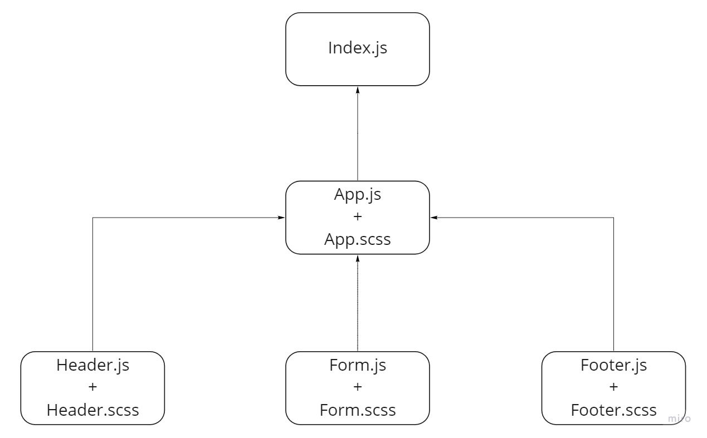

# LAB - Class 27

## Project: RESTy

### Author: Abdulhakim Zatar

### Links and Resources

- [ci/cd](https://github.com/zatar-401-advanced-javascript/resty/actions) (GitHub Actions)

### Setup

#### `.env` requirements

#### How to initialize/run your application (where applicable)

- e.g. `npm start`

#### UML

